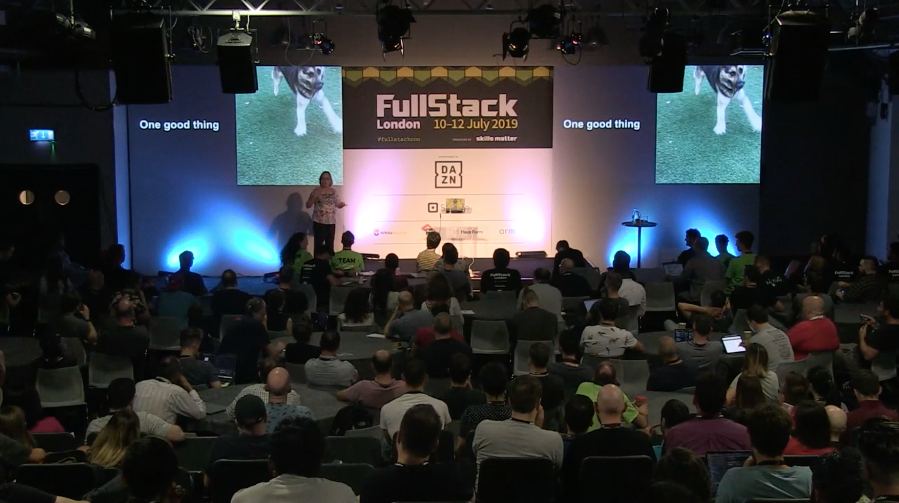
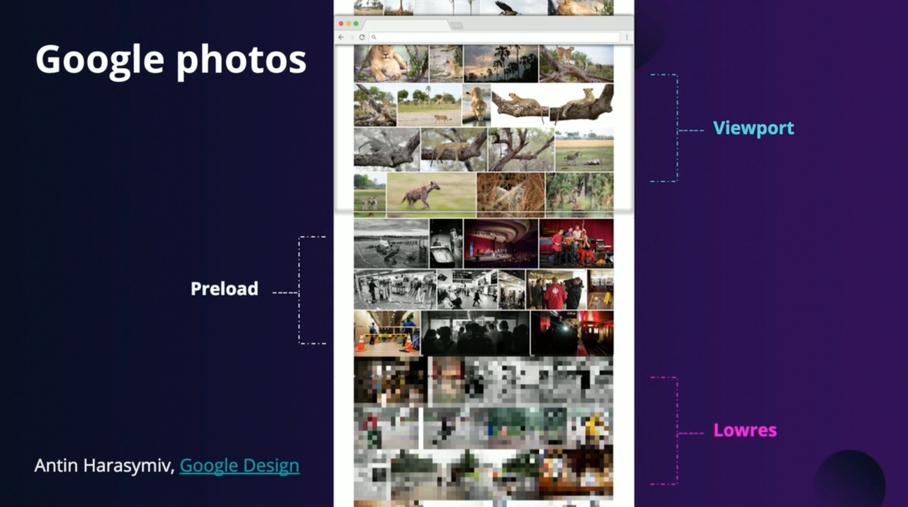

# How to outsmart your own brain

Sarah Clark

Program Manager at Google

The brain plays trick on us.

Question "What did you like so far?" activates so called Working sets (we all have something called 'context dependent memory' - we want to switch the context to the correct one) => our brain can hold to plus minus 5 items at top and is swapping the items.

Good questions to activate the brain are:

* Tell me one thing you liked so far
* Can't remember? Start with something trivial

=> Put customers in the "right frame of mind"

## Your brain is lying to you

If we touch our foot and our nose at the same time, our brain doesn't receive the information at the same time (takes about 80ms from leg to reach the brain) - brain is actually delaying the signal from our nose by 80 ms.

We are all living 0.1 second in the past. There is about 100ms delay before any input reach the consciousness, therefore applications should respond in under 100ms to user input.

💡 ***Create arduino machine to test the delay***

### Usage

* Use animation / sound to lead users
* Experiment with techniques to reduce **perceived** loading time, e.g. display placeholder before real content is loaded [some tips here](https://en.ryte.com/magazine/perceived-vs-actual-loading-time-create-the-impression-of-a-fast-website)
* Use animated placeholders before the real data loads
* Use loader that slows down exponentially :)

## Your eyes are lying to you

Our brain predicts: [flash-lag effect](http://www.law-11.com/flash-lag-effect.html)

We see only 4.5 degree angle sharply, everything else we see blured and it's our brain that buffers what's there.
Our eyes are set to see edges of things, not fills.

* Google Photos take advantage of this and display pixelated images until it loads them

[book] Jeff Hawkings - On Intelligence

Our brain is predicting and if it predicts something wrong, then that's where learning happens.

It is much easier to learn something by trial-error than by simply memorizing.

## How tho learn things easier

* Unit testing as a learning tool => write unit test and try to write a code later. Great and fast way to learn a new programming language
* Start with something you know and build up => our brain likes small adjustments and additional information, it doesn't like to learn big thing at once (e.g. reading a book) as it is energetically demanding. Reading the whole documentation of some language at once doesn't work, we should learn what we need at the given time, bit by bit.
* Learning is sensitive to emotion => **find what's relevant to you**, if you enjoy something, you learn it much faster and easier (boredom is not emotion 😁)

## General tips when teaching

* Ask "Where do people get this wrong?" not "Tell me all about this"
* Give people realistic environments
* Activate the right working set first (switch to the correct context)
