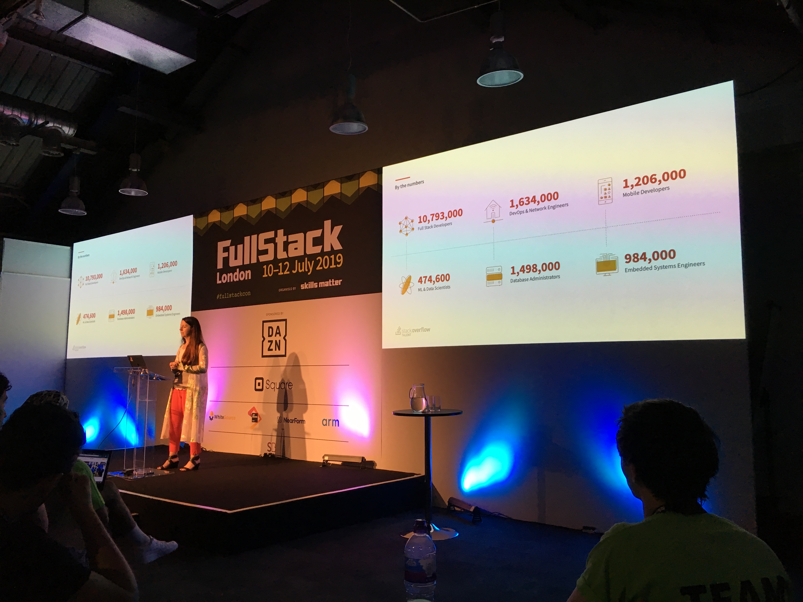

# Sourcing and Hiring Senior Engineers

(And how to get hired as a junior)

Sara Chipps from Stack Overflow

## Helping developers write the script for the future

* building communities where everyone who codes can learn and share their knowledge
* connecting developers with companies to help them find the right job, product or service
* world's largest developer community

? ***Check out NodeBots community***

## Ways to reach for engineers that works

* Digital world
* Events => try to target developers' interest with hackathons and come up with interesting topics and/or speakers. Have an inclusive environment there.
* Internal employees

## How to attract candidates

* interesting job ad and branding
* focus on what matters to candidates, e.g. good benefits for themselves and their families, professional growth, also remote work option is usually desired

## Results of annual survey

* 74 % of developers are open to new opportunities though not actively looking for a job (only 15 % is)
* It's hard to know how senior a developer really is

[note] Boot camp graduates are usually very quick learners and though they might seem junior, they will get senior very soon

? ***Check out dev posts online hackathons***

## As an employee, focus on what matters to employers

* good attitude and desire to learn
* practice the interview, try e.g. `interviewing.io` to take common interview questions
* As a junior, plan for the longer period, it could take 6 months to find a first job. Apply for 5 jobs a day.

## Sharpen your skills

* `learn.co`
* `Code Academy`
* `Udemy`

Senior developer by her definition => someone who you can give a spec, walk away and when you come back, you will see a completed product :D

[interesting idea] When one person is on Webex, everybody (though sitting in one room) should take headphones and connect to the Webex so that they share equal experience from the call
