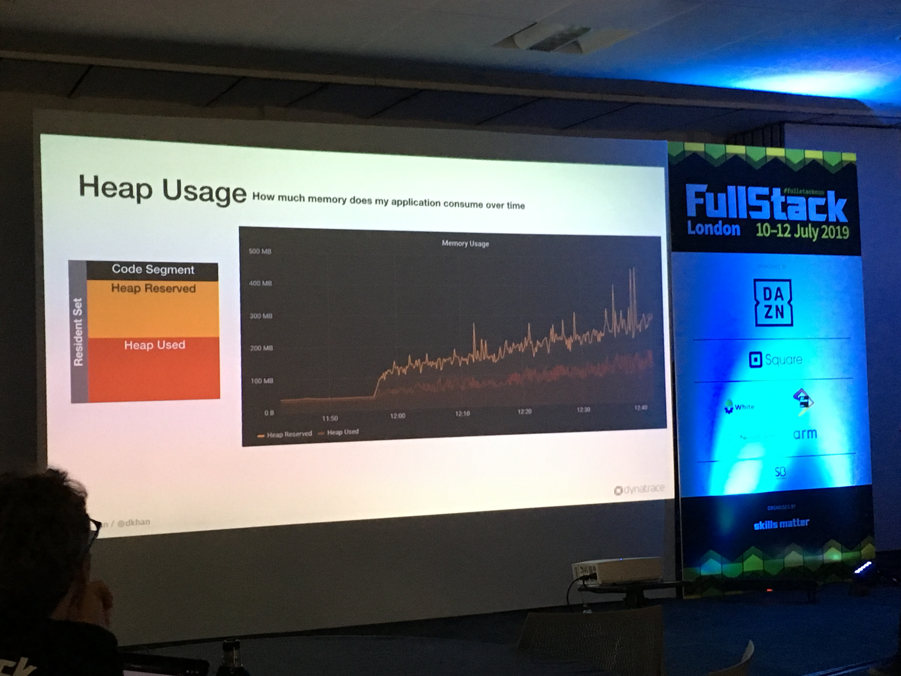
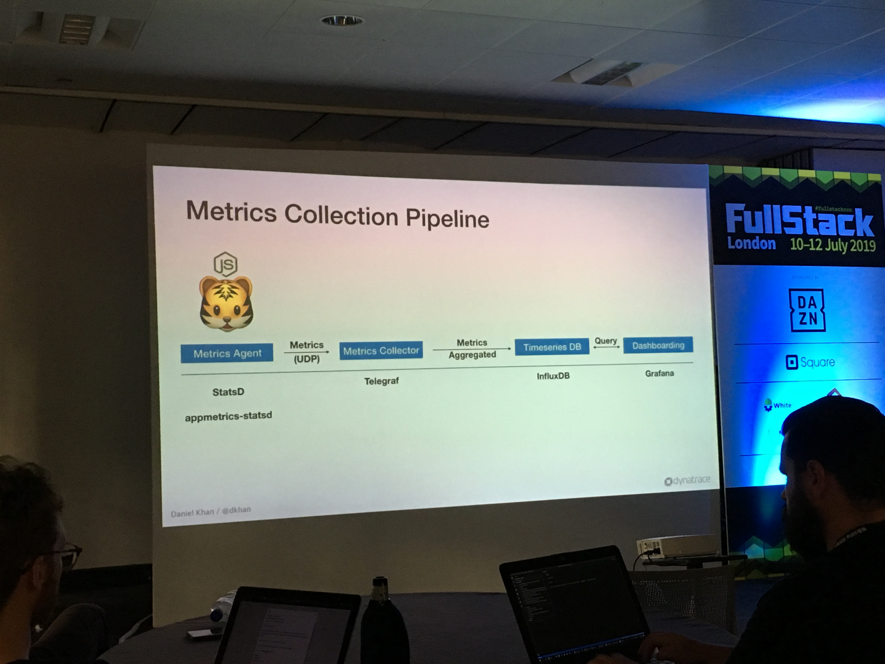

# Tracing Node - The Open Source Edition

Daniel Khan

@dkhan
Lead Technology Strategist @Dynatrace

## Important metrics

### Response time

Difference between HTTP Request and HTTP Response (e.g. `res.send()`)

### Node.js event loop

? ***Check out author's talk about event loop***

Event loop consists of **phases** and Node.js will run through those phases periodically:

* Timers - everything set via `setTimeout` or `setInterval`
* Callbacks - most of our code, e.g. `http.createServer(requestHandler)`
* I/O polling - e.g. `fs.readFile`
* Set immediate - everything set by `setImmediate`
* Close events - all closing is handled here

### Heap Usage

How much memory does my application consume over time

### GC (garbage collector) Duration

* How often and how long does the garbage collector rum
* GC looks at everything that's on the heap and free up the memory if it's no longer in use. It knows that something is not used by looking at a graph.
* If the GC is running, we can be sure, that application will not do anything. It can dramatically influence the performance of our application.

### CPU Usage

How much time does my application consume.

[Hands on exercise]
[https://github.com/danielkhan/tracing-node-workshop-tutorial](https://github.com/danielkhan/tracing-node-workshop-tutorial)
[https://etherpad.wikimedia.org/p/tracing-node](https://etherpad.wikimedia.org/p/tracing-node)

`StatsD` => metrics agent that sends metrics via UDP to metrics collector, e.g. telegraf

`killall -n node`

## Tracing

Metrics can tell us what is happening, but tracing will tell us where it is happening.

We need to have some "context propagation" => we pass some context ID throughout all the services so that we know that they are related.

? ***Check out OPENTRACING***
