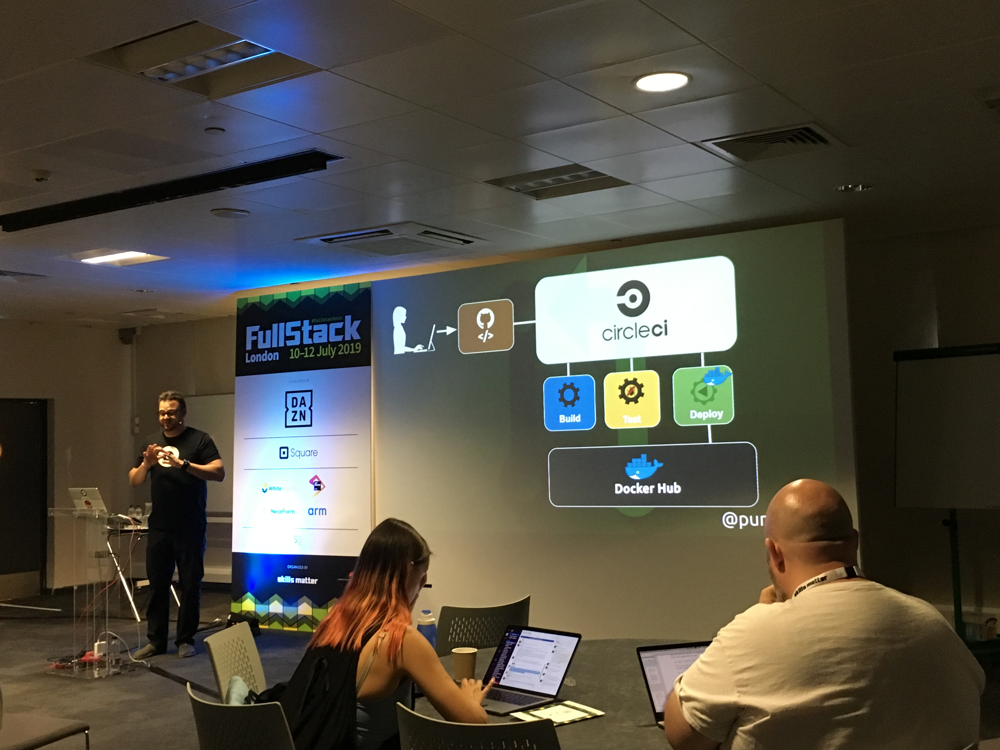

# Workshop: CI/CD 101 with CircleCI

Angel Rivera

@punkdata

Developer Advocate @ CircleCI => his job is to **inspire** developers

Started programming in the US military (US air force)

## Testing

* If we are developing software, testing is really important.
* Time is the most important asset. Our tests should be executed in a timely manner

## Continuous Integration (CI)

* Developers merge code changes often
* Run automated tests to validate builds
* Only tested code is integrated into code base
* Merge changes frequently into release branch

## Continuous Delivery (CD)

* Ability to increase our release cycles
* Low risk releases
* Higher quality
* Lower costs

CI/CD is very closely related to DevOps.

CircleCI is CI/CD platform - it is monitoring the GitHub repository and once there is a code merge, the pipeline is executed.

Containerization of our application is very important, use Docker!

Docker login and password lives in CircleCI in project configuration in "build settings" => "environment variables"

[https://github.com/datapunkz/nodejs-cicd-workshop](https://github.com/datapunkz/nodejs-cicd-workshop)
[https://github.com/datapunkz/python-cicd-workshop](https://github.com/datapunkz/python-cicd-workshop)
