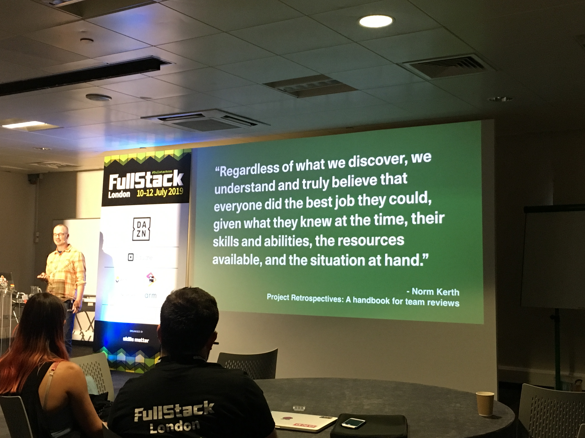
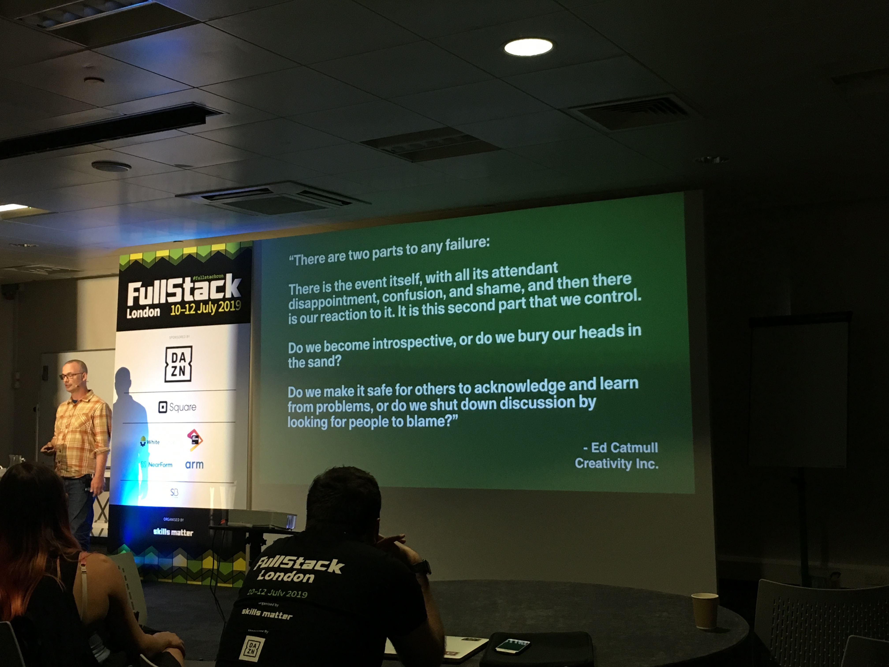

# Lightning Talk: Learning through Blameless Reviews

Joel Chippindale

We all make mistakes. It's inevitable. But how do we react to mistakes?

Two very natural reactions, that are also very problematic, though:

* Blame someone - it's attractive because it lets you off the hook (I am still perfect, it someone else who is guilty). Also we view our own mistakes as a result of circumstances and other people's mistake.

But What does our team learn when we blame people for mistakes? => To hide their actions and to avoid taking risks, which is both malicious.

* Pretending we haven't made any mistakes => e.g. reframe every mistake as a success.

But What does our team learn when we blame people for mistakes? Nothing

## A blameless review

* Bring everyone involved including stakeholders
* Understand what happened
  * be curious in discovering that
  * give everyone pace to express they thoughts
  * don't just focus on the negative

* Decide on changes for the future
  * Focus only on actions that those in the review can control
  * Keep the list short! => 3 at maximum, change is hard

If we do it right, our team will improve and more importantly the team members will **trust each other** and that's essential.

Mistake happens, but how do we react to the situation is what we can control and it is the only thing that matters!

